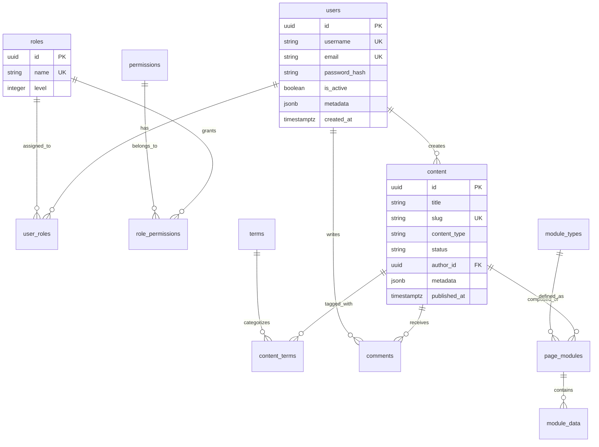

# 项目结构总览文档

本文档详细说明了现代化CMS系统的完整项目结构，包括后端代码结构、前端代码结构、Docker配置、数据库结构和配置文件说明。

## 📁 完整项目结构

```
modern-cms/
├── 📂 backend/                          # FastAPI后端服务
│   ├── 📂 app/                          # 应用程序主目录
│   │   ├── 📂 api/                      # API路由层
│   │   │   ├── 📂 v1/                   # API版本1
│   │   │   │   ├── 📄 __init__.py
│   │   │   │   ├── 📄 auth.py           # 认证相关API
│   │   │   │   ├── 📄 users.py          # 用户管理API
│   │   │   │   ├── 📄 content.py        # 内容管理API
│   │   │   │   ├── 📄 media.py          # 媒体文件API
│   │   │   │   ├── 📄 modules.py        # 模块管理API
│   │   │   │   ├── 📄 comments.py       # 评论管理API
│   │   │   │   └── 📄 stats.py          # 统计分析API
│   │   │   └── 📄 __init__.py
│   │   ├── 📂 core/                     # 核心功能模块
│   │   │   ├── 📄 __init__.py
│   │   │   ├── 📄 security.py           # 安全相关功能
│   │   │   ├── 📄 pagination.py         # 分页功能
│   │   │   └── 📄 permissions.py        # 权限控制
│   │   ├── 📂 models/                   # 数据模型
│   │   │   ├── 📄 __init__.py
│   │   │   ├── 📄 user.py               # 用户模型
│   │   │   ├── 📄 content.py            # 内容模型
│   │   │   ├── 📄 media.py              # 媒体模型
│   │   │   ├── 📄 comment.py            # 评论模型
│   │   │   ├── 📄 module.py             # 模块模型
│   │   │   └── 📄 associations.py       # 关联模型
│   │   ├── 📂 schemas/                  # Pydantic模式
│   │   │   ├── 📄 __init__.py
│   │   │   ├── 📄 user.py               # 用户数据模式
│   │   │   ├── 📄 content.py            # 内容数据模式
│   │   │   ├── 📄 media.py              # 媒体数据模式
│   │   │   ├── 📄 comment.py            # 评论数据模式
│   │   │   └── 📄 module.py             # 模块数据模式
│   │   ├── 📂 utils/                    # 工具函数
│   │   │   ├── 📄 __init__.py
│   │   │   ├── 📄 database.py           # 数据库工具
│   │   │   ├── 📄 cache.py              # 缓存工具
│   │   │   ├── 📄 file_handler.py       # 文件处理工具
│   │   │   └── 📄 validators.py         # 数据验证器
│   │   ├── 📄 __init__.py
│   │   ├── 📄 config.py                 # 配置文件
│   │   ├── 📄 database.py               # 数据库连接
│   │   └── 📄 main.py                   # 主应用程序
│   ├── 📄 requirements.txt              # Python依赖
│   ├── 📄 Dockerfile                    # 后端Docker配置
│   ├── 📄 .dockerignore                 # Docker忽略文件
│   └── 📄 start.sh                      # 启动脚本
│
├── 📂 frontend/                         # 前端应用
│   ├── 📂 admin/                        # 管理后台
│   │   ├── 📂 public/                   # 静态资源
│   │   ├── 📂 src/                      # 源代码
│   │   │   ├── 📂 api/                  # API客户端
│   │   │   │   ├── 📄 auth.ts           # 认证API
│   │   │   │   ├── 📄 client.ts         # HTTP客户端
│   │   │   │   ├── 📄 content.ts        # 内容API
│   │   │   │   ├── 📄 media.ts          # 媒体API
│   │   │   │   └── 📄 users.ts          # 用户API
│   │   │   ├── 📂 components/           # 公共组件
│   │   │   │   ├── 📄 ErrorBoundary.tsx # 错误边界
│   │   │   │   ├── 📄 MainLayout.tsx    # 主布局
│   │   │   │   ├── 📂 ui/               # UI基础组件
│   │   │   │   └── 📂 forms/            # 表单组件
│   │   │   ├── 📂 hooks/                # 自定义Hook
│   │   │   │   ├── 📄 use-mobile.tsx    # 移动端检测
│   │   │   │   ├── 📄 use-auth.ts       # 认证Hook
│   │   │   │   └── 📄 use-api.ts        # API调用Hook
│   │   │   ├── 📂 lib/                  # 工具库
│   │   │   │   ├── 📄 utils.ts          # 工具函数
│   │   │   │   ├── 📄 api.ts            # API封装
│   │   │   │   └── 📄 constants.ts      # 常量定义
│   │   │   ├── 📂 pages/                # 页面组件
│   │   │   │   ├── 📄 DashboardPage.tsx # 仪表板
│   │   │   │   ├── 📄 LoginPage.tsx     # 登录页
│   │   │   │   ├── 📄 ContentListPage.tsx      # 内容列表
│   │   │   │   ├── 📄 ContentEditorPage.tsx    # 内容编辑
│   │   │   │   ├── 📄 MediaLibraryPage.tsx     # 媒体库
│   │   │   │   ├── 📄 UserManagementPage.tsx   # 用户管理
│   │   │   │   ├── 📄 PageBuilderPage.tsx      # 页面构建器
│   │   │   │   ├── 📄 SettingsPage.tsx         # 系统设置
│   │   │   │   └── 📄 CommentManagementPage.tsx # 评论管理
│   │   │   ├── 📂 store/                # 状态管理
│   │   │   │   ├── 📄 auth.ts           # 认证状态
│   │   │   │   ├── 📄 content.ts        # 内容状态
│   │   │   │   ├── 📄 ui.ts             # UI状态
│   │   │   │   └── 📄 index.ts          # 状态入口
│   │   │   ├── 📂 styles/               # 样式文件
│   │   │   │   ├── 📄 globals.css       # 全局样式
│   │   │   │   └── 📄 components.css    # 组件样式
│   │   │   ├── 📂 types/                # TypeScript类型
│   │   │   │   ├── 📄 api.ts            # API类型
│   │   │   │   ├── 📄 user.ts           # 用户类型
│   │   │   │   ├── 📄 content.ts        # 内容类型
│   │   │   │   └── 📄 index.ts          # 类型入口
│   │   │   ├── 📄 App.tsx               # 主应用组件
│   │   │   ├── 📄 main.tsx              # 应用入口
│   │   │   ├── 📄 vite-env.d.ts         # Vite类型声明
│   │   │   └── 📄 index.css             # 样式入口
│   │   ├── 📄 package.json              # NPM依赖配置
│   │   ├── 📄 pnpm-lock.yaml            # 锁定文件
│   │   ├── 📄 vite.config.ts            # Vite配置
│   │   ├── 📄 tsconfig.json             # TypeScript配置
│   │   ├── 📄 tsconfig.app.json         # 应用TS配置
│   │   ├── 📄 tsconfig.node.json        # Node TS配置
│   │   ├── 📄 tailwind.config.js        # Tailwind配置
│   │   ├── 📄 postcss.config.js         # PostCSS配置
│   │   ├── 📄 components.json           # 组件配置
│   │   ├── 📄 eslint.config.js          # ESLint配置
│   │   ├── 📄 Dockerfile                # 前端Docker配置
│   │   ├── 📄 nginx.conf                # Nginx配置
│   │   └── 📄 .env.example              # 环境变量模板
│   │
│   └── 📂 blog/                         # 博客前端
│       ├── 📂 public/                   # 静态资源
│       ├── 📂 src/                      # 源代码
│       │   ├── 📂 components/           # 组件
│       │   │   ├── 📄 Layout.tsx        # 布局组件
│       │   │   ├── 📄 Header.tsx        # 头部组件
│       │   │   ├── 📄 Footer.tsx        # 底部组件
│       │   │   ├── 📄 ArticleCard.tsx   # 文章卡片
│       │   │   └── 📄 Pagination.tsx    # 分页组件
│       │   ├── 📂 pages/                # 页面
│       │   │   ├── 📄 HomePage.tsx      # 首页
│       │   │   ├── 📄 ArticlePage.tsx   # 文章页
│       │   │   ├── 📄 CategoryPage.tsx  # 分类页
│       │   │   ├── 📄 TagPage.tsx       # 标签页
│       │   │   └── 📄 AboutPage.tsx     # 关于页
│       │   ├── 📂 api/                  # API调用
│       │   ├── 📂 utils/                # 工具函数
│       │   ├── 📂 types/                # 类型定义
│       │   ├── 📄 App.tsx               # 主应用
│       │   ├── 📄 main.tsx              # 入口文件
│       │   └── 📄 index.css             # 样式文件
│       ├── 📄 package.json
│       ├── 📄 vite.config.ts
│       ├── 📄 tsconfig.json
│       ├── 📄 tailwind.config.js
│       ├── 📄 Dockerfile
│       └── 📄 nginx.conf
│
├── 📂 nginx/                            # Nginx配置
│   ├── 📄 nginx.conf                    # 主配置文件
│   ├── 📄 nginx.dev.conf                # 开发环境配置
│   ├── 📄 nginx.prod.conf               # 生产环境配置
│   └── 📂 conf.d/                       # 额外配置
│       ├── 📄 default.conf              # 默认虚拟主机
│       ├── 📄 api.conf                  # API配置
│       └── 📄 admin.conf                # 管理后台配置
│
├── 📂 code/                             # 代码相关
│   └── 📂 database/                     # 数据库文件
│       ├── 📄 schema.sql                # 数据库Schema
│       ├── 📄 migrations/               # 迁移文件
│       │   └── 📂 versions/             # 版本化迁移
│       ├── 📄 seeds/                    # 种子数据
│       │   ├── 📄 001_initial_data.sql  # 初始数据
│       │   └── 📄 002_sample_content.sql # 示例内容
│       ├── 📄 functions/                # 存储函数
│       │   ├── 📄 user_functions.sql    # 用户相关函数
│       │   └── 📄 content_functions.sql # 内容相关函数
│       └── 📄 README.md                 # 数据库文档
│
├── 📂 docs/                             # 项目文档
│   ├── 📄 system_architecture.md        # 系统架构文档
│   ├── 📄 database_design.md            # 数据库设计文档
│   ├── 📄 docker_development_strategy.md # Docker开发策略
│   ├── 📄 wordpress_analysis.md         # WordPress分析文档
│   ├── 📄 module_builder_research.md    # 模块构建器研究
│   └── 📂 api/                          # API文档
│       ├── 📄 authentication.md         # 认证API文档
│       ├── 📄 content_api.md            # 内容API文档
│       ├── 📄 media_api.md              # 媒体API文档
│       └── 📄 user_api.md               # 用户API文档
│
├── 📂 scripts/                          # 部署和维护脚本
│   ├── 📄 deploy.sh                     # 部署脚本
│   ├── 📄 backup.sh                     # 备份脚本
│   ├── 📄 restore.sh                    # 恢复脚本
│   ├── 📄 health-check.sh               # 健康检查脚本
│   └── 📄 maintenance.sh                # 维护脚本
│
├── 📂 tests/                            # 测试文件
│   ├── 📂 backend/                      # 后端测试
│   │   ├── 📂 unit/                     # 单元测试
│   │   ├── 📂 integration/              # 集成测试
│   │   └── 📂 fixtures/                 # 测试数据
│   ├── 📂 frontend/                     # 前端测试
│   │   ├── 📂 unit/                     # 单元测试
│   │   ├── 📂 e2e/                      # 端到端测试
│   │   └── 📂 fixtures/                 # 测试数据
│   └── 📂 api/                          # API测试
│       ├── 📂 auth/                     # 认证测试
│       ├── 📂 content/                  # 内容测试
│       └── 📂 media/                    # 媒体测试
│
├── 📂 .github/                          # GitHub配置
│   └── 📂 workflows/                    # GitHub Actions
│       ├── 📄 ci.yml                    # CI流程
│       ├── 📄 deploy.yml                # 部署流程
│       └── 📄 security.yml              # 安全扫描
│
├── 📂 .docker/                          # Docker相关
│   ├── 📂 nginx/                        # Nginx Dockerfile
│   ├── 📄 docker compose.dev.yml        # 开发环境编排
│   ├── 📄 docker compose.prod.yml       # 生产环境编排
│   └── 📄 .env.example                  # 环境变量模板
│
├── 📂 .vscode/                          # VS Code配置
│   ├── 📄 settings.json                 # 编辑器设置
│   ├── 📄 extensions.json               # 推荐扩展
│   └── 📄 launch.json                   # 调试配置
│
├── 📄 docker compose.yml                # 主Docker编排文件
├── 📄 docker compose.override.yml       # 覆盖配置
├── 📄 README.md                         # 项目说明
├── 📄 DEPLOYMENT.md                     # 部署指南
├── 📄 PROJECT_STRUCTURE.md              # 项目结构文档
├── 📄 LICENSE                           # 开源协议
├── 📄 .gitignore                        # Git忽略文件
├── 📄 .editorconfig                     # 编辑器配置
├── 📄 .prettierrc                       # Prettier配置
├── 📄 .eslintrc.js                      # ESLint配置
└── 📄 Makefile                          # Make命令
```

## 🏗️ 后端代码结构详解

### 应用架构层次

后端采用经典的三层架构模式：

```
┌─────────────────┐
│   API Layer     │  ← 路由层 (routers)
├─────────────────┤
│  Business Logic │  ← 业务逻辑层 (services)
├─────────────────┤
│   Data Access   │  ← 数据访问层 (models)
├─────────────────┤
│   Database      │  ← PostgreSQL
└─────────────────┘
```

### 核心模块说明

#### 1. API路由层 (`/backend/app/api/`)

```python
# auth.py - 认证模块
from fastapi import APIRouter, Depends, HTTPException
from fastapi.security import OAuth2PasswordBearer
from sqlalchemy.orm import Session
from app.core.security import verify_token
from app.schemas.auth import LoginRequest, RegisterRequest

router = APIRouter()

@router.post("/login")
async def login(credentials: LoginRequest, db: Session = Depends(get_db)):
    """用户登录"""
    pass

@router.post("/register")
async def register(user_data: RegisterRequest, db: Session = Depends(get_db)):
    """用户注册"""
    pass

@router.get("/me")
async def get_current_user(current_user = Depends(get_current_user)):
    """获取当前用户信息"""
    pass
```

#### 2. 数据模型层 (`/backend/app/models/`)

```python
# user.py - 用户模型
from sqlalchemy import Column, String, Boolean, DateTime, Text
from sqlalchemy.dialects.postgresql import UUID
import uuid

class User(Base):
    __tablename__ = "users"
    
    id = Column(UUID(as_uuid=True), primary_key=True, default=uuid.uuid4)
    username = Column(String(50), unique=True, nullable=False)
    email = Column(String(255), unique=True, nullable=False)
    password_hash = Column(String(255), nullable=False)
    is_active = Column(Boolean, default=True)
    created_at = Column(DateTime(timezone=True), server_default=func.now())
    updated_at = Column(DateTime(timezone=True), onupdate=func.now())
    
    # 关联关系
    roles = relationship("UserRole", back_populates="user")
    contents = relationship("Content", back_populates="author")
```

#### 3. 数据模式层 (`/backend/app/schemas/`)

```python
# user.py - 用户模式
from pydantic import BaseModel, EmailStr, validator
from typing import Optional
from datetime import datetime
import uuid

class UserBase(BaseModel):
    username: str
    email: EmailStr
    display_name: Optional[str] = None

class UserCreate(UserBase):
    password: str
    
    @validator('password')
    def validate_password(cls, v):
        if len(v) < 8:
            raise ValueError('密码长度至少8位')
        return v

class UserResponse(UserBase):
    id: uuid.UUID
    is_active: bool
    created_at: datetime
    updated_at: Optional[datetime]
    
    class Config:
        from_attributes = True
```

#### 4. 核心功能模块 (`/backend/app/core/`)

```python
# security.py - 安全功能
from datetime import datetime, timedelta
from typing import Optional
from jose import JWTError, jwt
from passlib.context import CryptContext
from fastapi import HTTPException, status

# 密码加密上下文
pwd_context = CryptContext(schemes=["bcrypt"], deprecated="auto")

# JWT配置
SECRET_KEY = "your-secret-key"
ALGORITHM = "HS256"
ACCESS_TOKEN_EXPIRE_MINUTES = 30

def verify_password(plain_password: str, hashed_password: str) -> bool:
    """验证密码"""
    return pwd_context.verify(plain_password, hashed_password)

def get_password_hash(password: str) -> str:
    """获取密码哈希"""
    return pwd_context.hash(password)

def create_access_token(data: dict, expires_delta: Optional[timedelta] = None):
    """创建访问令牌"""
    to_encode = data.copy()
    if expires_delta:
        expire = datetime.utcnow() + expires_delta
    else:
        expire = datetime.utcnow() + timedelta(minutes=15)
    to_encode.update({"exp": expire})
    encoded_jwt = jwt.encode(to_encode, SECRET_KEY, algorithm=ALGORITHM)
    return encoded_jwt
```

## 🎨 前端代码结构详解

### 组件架构

前端采用组件化设计模式：

```
src/
├── components/     # 公共组件 (可复用)
├── pages/         # 页面组件 (路由级)
├── hooks/         # 自定义Hook (逻辑复用)
├── utils/         # 工具函数
├── api/           # API调用
├── store/         # 状态管理
├── types/         # TypeScript类型
└── styles/        # 样式文件
```

### 状态管理架构

使用Zustand进行轻量级状态管理：

```typescript
// store/auth.ts
import { create } from 'zustand'
import { persist } from 'zustand/middleware'

interface User {
  id: string
  username: string
  email: string
  roles: string[]
}

interface AuthState {
  user: User | null
  token: string | null
  isAuthenticated: boolean
  login: (credentials: LoginCredentials) => Promise<void>
  logout: () => void
  setUser: (user: User) => void
}

export const useAuthStore = create<AuthState>()(
  persist(
    (set, get) => ({
      user: null,
      token: null,
      isAuthenticated: false,
      
      login: async (credentials) => {
        const response = await authApi.login(credentials)
        set({
          user: response.user,
          token: response.access_token,
          isAuthenticated: true
        })
      },
      
      logout: () => {
        set({
          user: null,
          token: null,
          isAuthenticated: false
        })
      },
      
      setUser: (user) => set({ user })
    }),
    {
      name: 'auth-storage',
      partialize: (state) => ({
        user: state.user,
        token: state.token
      })
    }
  )
)
```

### 页面组件结构

```typescript
// pages/ContentEditorPage.tsx
import React, { useState, useEffect } from 'react'
import { useParams, useNavigate } from 'react-router-dom'
import { useAuthStore } from '../store/auth'
import { contentApi } from '../api/content'
import { ContentEditor } from '../components/ContentEditor'
import { Button, message } from 'antd'

export const ContentEditorPage: React.FC = () => {
  const { id } = useParams<{ id: string }>()
  const navigate = useNavigate()
  const { user } = useAuthStore()
  const [loading, setLoading] = useState(false)
  const [content, setContent] = useState<Content | null>(null)

  useEffect(() => {
    if (id && id !== 'new') {
      loadContent()
    }
  }, [id])

  const loadContent = async () => {
    try {
      setLoading(true)
      const response = await contentApi.getContent(id!)
      setContent(response.data)
    } catch (error) {
      message.error('加载内容失败')
    } finally {
      setLoading(false)
    }
  }

  const handleSave = async (contentData: ContentData) => {
    try {
      if (id === 'new') {
        await contentApi.createContent(contentData)
        message.success('创建成功')
      } else {
        await contentApi.updateContent(id, contentData)
        message.success('保存成功')
      }
      navigate('/content')
    } catch (error) {
      message.error('保存失败')
    }
  }

  return (
    <div className="content-editor-page">
      <ContentEditor
        content={content}
        onSave={handleSave}
        loading={loading}
      />
    </div>
  )
}
```

## 🐳 Docker配置详解

### 多环境配置策略

```
┌─────────────────┐
│  docker compose.yml      │  ← 基础配置 (所有环境通用)
├─────────────────┤
│  docker compose.dev.yml  │  ← 开发环境 (覆盖基础配置)
├─────────────────┤
│  docker compose.prod.yml │  ← 生产环境 (覆盖基础配置)
└─────────────────┘
```

### 基础配置 (`docker compose.yml`)

```yaml
version: '3.8'

services:
  # PostgreSQL数据库
  postgres:
    image: postgres:15-alpine
    container_name: cms_postgres
    environment:
      POSTGRES_USER: ${DB_USERNAME:-postgres}
      POSTGRES_PASSWORD: ${DB_PASSWORD}
      POSTGRES_DB: ${DB_NAME:-cms_db}
    volumes:
      - postgres_data:/var/lib/postgresql/data
      - ./code/database/schema.sql:/docker-entrypoint-initdb.d/schema.sql
    healthcheck:
      test: ["CMD-SHELL", "pg_isready -U ${DB_USERNAME:-postgres}"]
      interval: 10s
      timeout: 5s
      retries: 5
    networks:
      - cms_network

  # Redis缓存
  redis:
    image: redis:7-alpine
    container_name: cms_redis
    healthcheck:
      test: ["CMD", "redis-cli", "ping"]
      interval: 10s
      timeout: 3s
      retries: 5
    networks:
      - cms_network

  # FastAPI后端
  api:
    build:
      context: ./backend
      dockerfile: Dockerfile
    container_name: cms_api
    environment:
      - DATABASE_URL=${DATABASE_URL}
      - REDIS_URL=${REDIS_URL}
      - SECRET_KEY=${SECRET_KEY}
      - DEBUG=${DEBUG:-false}
      - ALLOWED_ORIGINS=${ALLOWED_ORIGINS}
    ports:
      - "8000:8000"
    volumes:
      - ./backend/app:/app/app
      - ./uploads:/app/uploads
    depends_on:
      postgres:
        condition: service_healthy
      redis:
        condition: service_healthy
    networks:
      - cms_network

volumes:
  postgres_data:

networks:
  cms_network:
    driver: bridge
```

### 开发环境配置 (`docker compose.dev.yml`)

```yaml
version: '3.8'

services:
  api:
    build:
      context: ./backend
      dockerfile: Dockerfile.dev
    environment:
      - DEBUG=true
      - LOG_LEVEL=DEBUG
    volumes:
      - ./backend:/app
    ports:
      - "8000:8000"
      - "5678:5678"  # 调试端口

  admin:
    build:
      context: ./frontend/admin
      dockerfile: Dockerfile.dev
    environment:
      - VITE_API_URL=http://localhost:8000
      - VITE_WS_URL=ws://localhost:8000
    volumes:
      - ./frontend/admin:/app
      - /app/node_modules
    ports:
      - "3000:3000"

  blog:
    build:
      context: ./frontend/blog
      dockerfile: Dockerfile.dev
    environment:
      - VITE_API_URL=http://localhost:8000
    volumes:
      - ./frontend/blog:/app
      - /app/node_modules
    ports:
      - "3001:3000"

  nginx:
    volumes:
      - ./nginx/nginx.dev.conf:/etc/nginx/nginx.conf:ro
    ports:
      - "8080:80"  # 开发环境使用不同端口
```

### 生产环境配置 (`docker compose.prod.yml`)

```yaml
version: '3.8'

services:
  postgres:
    volumes:
      - postgres_data:/var/lib/postgresql/data
      - ./backups:/backups
    restart: unless-stopped
    environment:
      - POSTGRES_INITDB_ARGS=--encoding=UTF-8 --lc-collate=C --lc-ctype=C

  redis:
    command: redis-server --appendonly yes --requirepass ${REDIS_PASSWORD}
    volumes:
      - redis_data:/data
    restart: unless-stopped

  api:
    build:
      context: ./backend
      dockerfile: Dockerfile.prod
    environment:
      - DEBUG=false
      - LOG_LEVEL=INFO
    volumes: []  # 生产环境不挂载代码
    restart: unless-stopped
    healthcheck:
      test: ["CMD", "curl", "-f", "http://localhost:8000/health"]
      interval: 30s
      timeout: 10s
      retries: 3

  nginx:
    volumes:
      - ./nginx/nginx.prod.conf:/etc/nginx/nginx.conf:ro
      - ./ssl:/etc/nginx/ssl:ro
      - nginx_logs:/var/log/nginx
    restart: unless-stopped
    ports:
      - "80:80"
      - "443:443"

volumes:
  redis_data:
  nginx_logs:
```

### Dockerfile配置

#### 后端开发环境 (`backend/Dockerfile.dev`)

```dockerfile
FROM python:3.11-slim

# 安装系统依赖
RUN apt-get update && apt-get install -y \
    gcc \
    g++ \
    curl \
    && rm -rf /var/lib/apt/lists/*

# 设置工作目录
WORKDIR /app

# 复制依赖文件
COPY requirements.txt .

# 安装Python依赖
RUN pip install --no-cache-dir -r requirements.txt

# 复制应用代码
COPY . .

# 创建非root用户
RUN groupadd -r appuser && useradd -r -g appuser appuser
RUN chown -R appuser:appuser /app
USER appuser

# 暴露端口
EXPOSE 8000 5678

# 启动命令
CMD ["uvicorn", "app.main:app", "--host", "0.0.0.0", "--port", "8000", "--reload"]
```

#### 后端生产环境 (`backend/Dockerfile.prod`)

```dockerfile
# 构建阶段
FROM python:3.11-slim AS builder

WORKDIR /app
COPY requirements.txt .
RUN pip install --no-cache-dir --user -r requirements.txt

# 运行阶段
FROM python:3.11-slim AS runtime

# 安装运行时依赖
RUN apt-get update && apt-get install -y \
    curl \
    && rm -rf /var/lib/apt/lists/*

# 设置工作目录
WORKDIR /app

# 复制安装的包
COPY --from=builder /root/.local /root/.local

# 复制应用代码
COPY . .

# 创建非root用户
RUN groupadd -r appuser && useradd -r -g appuser appuser
RUN chown -R appuser:appuser /app
USER appuser

# 设置PATH
ENV PATH=/root/.local/bin:$PATH

# 暴露端口
EXPOSE 8000

# 健康检查
HEALTHCHECK --interval=30s --timeout=30s --start-period=5s --retries=3 \
  CMD curl -f http://localhost:8000/health || exit 1

# 启动命令
CMD ["uvicorn", "app.main:app", "--host", "0.0.0.0", "--port", "8000", "--workers", "4"]
```

## 🗄️ 数据库结构详解

### 核心表结构

```sql
-- =============================================
-- 1. 用户管理模块
-- =============================================

-- 用户表
CREATE TABLE users (
    id UUID PRIMARY KEY DEFAULT uuid_generate_v4(),
    username VARCHAR(50) UNIQUE NOT NULL,
    email VARCHAR(255) UNIQUE NOT NULL,
    display_name VARCHAR(100) NOT NULL,
    password_hash VARCHAR(255) NOT NULL,
    is_active BOOLEAN DEFAULT true,
    is_verified BOOLEAN DEFAULT false,
    created_at TIMESTAMPTZ DEFAULT CURRENT_TIMESTAMP,
    updated_at TIMESTAMPTZ DEFAULT CURRENT_TIMESTAMP,
    metadata JSONB DEFAULT '{}'::jsonb
);

-- 角色表
CREATE TABLE roles (
    id UUID PRIMARY KEY DEFAULT uuid_generate_v4(),
    name VARCHAR(50) UNIQUE NOT NULL,
    display_name VARCHAR(100) NOT NULL,
    description TEXT,
    level INTEGER DEFAULT 0,
    created_at TIMESTAMPTZ DEFAULT CURRENT_TIMESTAMP
);

-- 权限表
CREATE TABLE permissions (
    id UUID PRIMARY KEY DEFAULT uuid_generate_v4(),
    name VARCHAR(100) UNIQUE NOT NULL, -- 'posts.create'
    resource VARCHAR(50) NOT NULL,     -- 'posts'
    action VARCHAR(50) NOT NULL        -- 'create'
);

-- =============================================
-- 2. 内容管理模块
-- =============================================

-- 内容表 (统一内容模型)
CREATE TABLE content (
    id UUID PRIMARY KEY DEFAULT uuid_generate_v4(),
    title VARCHAR(500) NOT NULL,
    slug VARCHAR(200) UNIQUE NOT NULL,
    content_type VARCHAR(50) NOT NULL, -- 'post', 'page', 'custom'
    status VARCHAR(20) NOT NULL DEFAULT 'draft',
    content TEXT NOT NULL,
    content_json JSONB, -- 结构化内容
    author_id UUID NOT NULL REFERENCES users(id),
    published_at TIMESTAMPTZ,
    created_at TIMESTAMPTZ DEFAULT CURRENT_TIMESTAMP,
    updated_at TIMESTAMPTZ DEFAULT CURRENT_TIMESTAMP,
    metadata JSONB DEFAULT '{}'::jsonb
);

-- 分类法表
CREATE TABLE taxonomies (
    id UUID PRIMARY KEY DEFAULT uuid_generate_v4(),
    name VARCHAR(100) NOT NULL, -- 'category', 'tag'
    display_name VARCHAR(100) NOT NULL,
    is_hierarchical BOOLEAN DEFAULT false
);

-- 术语表
CREATE TABLE terms (
    id UUID PRIMARY KEY DEFAULT uuid_generate_v4(),
    taxonomy_id UUID NOT NULL REFERENCES taxonomies(id),
    name VARCHAR(100) NOT NULL,
    slug VARCHAR(100) NOT NULL,
    parent_id UUID REFERENCES terms(id)
);

-- =============================================
-- 3. 索引设计
-- =============================================

-- 用户表索引
CREATE INDEX idx_users_username ON users(username);
CREATE INDEX idx_users_email ON users(email);
CREATE INDEX idx_users_status ON users(is_active, is_verified);
CREATE INDEX idx_users_metadata ON users USING GIN(metadata);

-- 内容表索引
CREATE INDEX idx_content_type_status ON content(content_type, status);
CREATE INDEX idx_content_author ON content(author_id);
CREATE INDEX idx_content_published ON content(published_at DESC);
CREATE INDEX idx_content_search ON content USING GIN(to_tsvector('english', title || ' ' || content));
CREATE INDEX idx_content_metadata ON content USING GIN(metadata);
```

### 数据库关系图



## ⚙️ 配置文件说明

### 环境变量配置

```bash
# .env.example - 环境变量模板

# ===========================================
# 数据库配置
# ===========================================
DB_HOST=localhost
DB_PORT=5432
DB_NAME=cms_db
DB_USERNAME=postgres
DB_PASSWORD=your_secure_password
DATABASE_URL=postgresql://${DB_USERNAME}:${DB_PASSWORD}@${DB_HOST}:${DB_PORT}/${DB_NAME}
DATABASE_ASYNC_URL=postgresql+asyncpg://${DB_USERNAME}:${DB_PASSWORD}@${DB_HOST}:${DB_PORT}/${DB_NAME}

# ===========================================
# Redis配置
# ===========================================
REDIS_HOST=localhost
REDIS_PORT=6379
REDIS_PASSWORD=your_redis_password
REDIS_URL=redis://:${REDIS_PASSWORD}@${REDIS_HOST}:${REDIS_PORT}/0

# ===========================================
# 应用配置
# ===========================================
SECRET_KEY=your-super-secret-key-change-in-production-min-32-chars
APP_ENV=development
DEBUG=true
APP_NAME="Modern CMS"
APP_VERSION=1.0.0

# ===========================================
# 安全配置
# ===========================================
ALLOWED_ORIGINS=http://localhost:3000,http://localhost:3001
CORS_ALLOW_CREDENTIALS=true
JWT_ALGORITHM=HS256
JWT_ACCESS_TOKEN_EXPIRE_MINUTES=30

# ===========================================
# 文件上传配置
# ===========================================
MAX_FILE_SIZE=10485760
UPLOAD_DIR=/app/uploads
ALLOWED_FILE_TYPES=jpg,jpeg,png,gif,pdf,doc,docx

# ===========================================
# 邮件配置
# ===========================================
SMTP_HOST=smtp.gmail.com
SMTP_PORT=587
SMTP_USERNAME=your-email@gmail.com
SMTP_PASSWORD=your-app-password
SMTP_USE_TLS=true
FROM_EMAIL=noreply@yourdomain.com

# ===========================================
# 日志配置
# ===========================================
LOG_LEVEL=INFO
LOG_FORMAT=json
LOG_FILE=/app/logs/app.log

# ===========================================
# 缓存配置
# ===========================================
CACHE_TTL=3600
SESSION_TTL=86400
CACHE_PREFIX=cms_

# ===========================================
# 第三方服务配置
# ===========================================
# AWS S3 (可选)
AWS_ACCESS_KEY_ID=your_access_key
AWS_SECRET_ACCESS_KEY=your_secret_key
AWS_REGION=us-east-1
AWS_S3_BUCKET=your-bucket-name

# CDN配置 (可选)
CDN_URL=https://cdn.yourdomain.com
```

### TypeScript配置

```json
// frontend/admin/tsconfig.json
{
  "compilerOptions": {
    "target": "ES2020",
    "useDefineForClassFields": true,
    "lib": ["ES2020", "DOM", "DOM.Iterable"],
    "module": "ESNext",
    "skipLibCheck": true,
    "moduleResolution": "bundler",
    "allowImportingTsExtensions": true,
    "resolveJsonModule": true,
    "isolatedModules": true,
    "noEmit": true,
    "jsx": "react-jsx",
    "strict": true,
    "noUnusedLocals": true,
    "noUnusedParameters": true,
    "noFallthroughCasesInSwitch": true,
    "baseUrl": ".",
    "paths": {
      "@/*": ["./src/*"],
      "@/components/*": ["./src/components/*"],
      "@/pages/*": ["./src/pages/*"],
      "@/api/*": ["./src/api/*"],
      "@/utils/*": ["./src/utils/*"],
      "@/types/*": ["./src/types/*"],
      "@/hooks/*": ["./src/hooks/*"],
      "@/store/*": ["./src/store/*"]
    }
  },
  "include": ["src"],
  "references": [{ "path": "./tsconfig.node.json" }]
}
```

### Vite配置

```typescript
// frontend/admin/vite.config.ts
import { defineConfig } from 'vite'
import react from '@vitejs/plugin-react'
import path from 'path'

export default defineConfig({
  plugins: [react()],
  resolve: {
    alias: {
      '@': path.resolve(__dirname, './src'),
      '@/components': path.resolve(__dirname, './src/components'),
      '@/pages': path.resolve(__dirname, './src/pages'),
      '@/api': path.resolve(__dirname, './src/api'),
      '@/utils': path.resolve(__dirname, './src/utils'),
      '@/types': path.resolve(__dirname, './src/types'),
      '@/hooks': path.resolve(__dirname, './src/hooks'),
      '@/store': path.resolve(__dirname, './src/store'),
    },
  },
  server: {
    port: 3000,
    host: true,
    proxy: {
      '/api': {
        target: 'http://localhost:8000',
        changeOrigin: true,
      },
    },
  },
  build: {
    outDir: 'dist',
    sourcemap: false,
    rollupOptions: {
      output: {
        manualChunks: {
          vendor: ['react', 'react-dom'],
          antd: ['antd'],
          ui: ['@radix-ui/react-dialog', '@radix-ui/react-dropdown-menu'],
        },
      },
    },
  },
})
```

### ESLint配置

```javascript
// frontend/admin/.eslintrc.js
module.exports = {
  root: true,
  env: { browser: true, es2020: true },
  extends: [
    'eslint:recommended',
    '@typescript-eslint/recommended',
    'plugin:react-hooks/recommended',
  ],
  ignorePatterns: ['dist', '.eslintrc.js'],
  parser: '@typescript-eslint/parser',
  plugins: ['react-refresh'],
  rules: {
    'react-refresh/only-export-components': [
      'warn',
      { allowConstantExport: true },
    ],
    '@typescript-eslint/no-unused-vars': ['error', { argsIgnorePattern: '^_' }],
    '@typescript-eslint/no-explicit-any': 'warn',
    'prefer-const': 'error',
    'no-var': 'error',
  },
}
```

### TailwindCSS配置

```javascript
// frontend/admin/tailwind.config.js
/** @type {import('tailwindcss').Config} */
module.exports = {
  content: [
    "./index.html",
    "./src/**/*.{js,ts,jsx,tsx}",
  ],
  theme: {
    extend: {
      colors: {
        primary: {
          50: '#eff6ff',
          100: '#dbeafe',
          500: '#3b82f6',
          600: '#2563eb',
          700: '#1d4ed8',
        },
      },
      fontFamily: {
        sans: ['Inter', 'system-ui', 'sans-serif'],
      },
      spacing: {
        '18': '4.5rem',
        '88': '22rem',
      },
      animation: {
        'fade-in': 'fadeIn 0.5s ease-in-out',
        'slide-up': 'slideUp 0.3s ease-out',
      },
    },
  },
  plugins: [
    require('@tailwindcss/forms'),
    require('@tailwindcss/typography'),
    require('@tailwindcss/aspect-ratio'),
  ],
}
```

## 🔧 开发工具配置

### Git配置

```bash
# .gitignore
# Dependencies
node_modules/
__pycache__/
*.pyc
*.pyo
*.pyd
.Python
env/
venv/
.venv/

# IDE
.vscode/
.idea/
*.swp
*.swo

# OS
.DS_Store
Thumbs.db

# Docker
.docker/
docker compose.override.yml

# Logs
logs/
*.log
npm-debug.log*
yarn-debug.log*
yarn-error.log*

# Environment
.env
.env.local
.env.*.local

# Build
dist/
build/
*.egg-info/

# Database
*.db
*.sqlite
*.sqlite3

# Uploads
uploads/
media/

# SSL certificates
*.pem
*.key
*.crt

# Backups
backups/
*.backup
*.dump

# Cache
.cache/
.temp/
.tmp/
```

### Prettier配置

```json
// .prettierrc
{
  "semi": false,
  "singleQuote": true,
  "tabWidth": 2,
  "trailingComma": "es5",
  "printWidth": 80,
  "bracketSpacing": true,
  "arrowParens": "avoid",
  "endOfLine": "lf",
  "quoteProps": "as-needed",
  "jsxSingleQuote": true
}
```

### Make命令配置

```makefile
# Makefile
.PHONY: help install build run test clean

# 默认目标
help:
	@echo "可用的Make命令:"
	@echo "  install    - 安装依赖"
	@echo "  build      - 构建应用"
	@echo "  run        - 运行应用"
	@echo "  test       - 运行测试"
	@echo "  lint       - 代码检查"
	@echo "  format     - 代码格式化"
	@echo "  clean      - 清理临时文件"

# 安装依赖
install:
	@echo "安装后端依赖..."
	cd backend && pip install -r requirements.txt
	@echo "安装前端依赖..."
	cd frontend/admin && pnpm install
	cd frontend/blog && pnpm install

# 构建应用
build:
	@echo "构建后端..."
	cd backend && docker build -t cms-api:latest .
	@echo "构建前端..."
	cd frontend/admin && docker build -t cms-admin:latest .
	cd frontend/blog && docker build -t cms-blog:latest .

# 运行应用
run:
	docker compose up -d

# 运行测试
test:
	@echo "运行后端测试..."
	cd backend && pytest
	@echo "运行前端测试..."
	cd frontend/admin && pnpm test

# 代码检查
lint:
	@echo "后端代码检查..."
	cd backend && flake8 .
	@echo "前端代码检查..."
	cd frontend/admin && pnpm lint

# 代码格式化
format:
	@echo "格式化Python代码..."
	cd backend && black .
	@echo "格式化TypeScript代码..."
	cd frontend/admin && pnpm format

# 清理临时文件
clean:
	docker compose down -v
	docker system prune -f
	rm -rf node_modules/
	rm -rf */node_modules/
	find . -name "*.pyc" -delete
	find . -name "__pycache__" -type d -exec rm -rf {} +
```

## 📊 总结

本项目结构设计遵循以下原则：

### 1. 架构清晰
- **分层架构**: 前后端分离，清晰的层次划分
- **模块化设计**: 功能模块独立，便于维护和扩展
- **组件化开发**: 可复用的组件库，减少重复代码

### 2. 开发友好
- **类型安全**: TypeScript提供完整类型检查
- **热重载**: 开发环境支持实时更新
- **代码规范**: ESLint + Prettier保证代码质量

### 3. 生产就绪
- **容器化**: Docker支持多环境部署
- **安全加固**: 多层安全措施保护
- **性能优化**: 缓存、压缩、CDN支持

### 4. 可扩展性
- **微服务架构**: 支持水平扩展
- **插件系统**: 灵活的扩展机制
- **多租户支持**: 预留多租户架构空间

### 5. 可维护性
- **文档完整**: 详细的文档说明
- **测试覆盖**: 单元测试和集成测试
- **监控告警**: 完善的监控体系

通过这个结构化的项目设计，开发团队可以高效地进行协作开发，系统可以稳定地运行在生产环境中，并且具备良好的扩展性和可维护性。